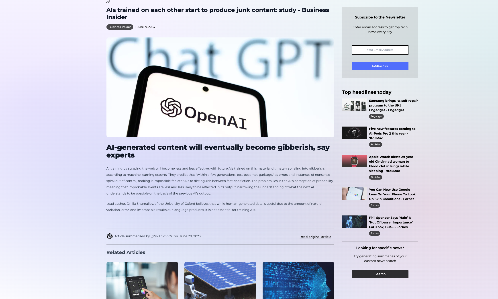
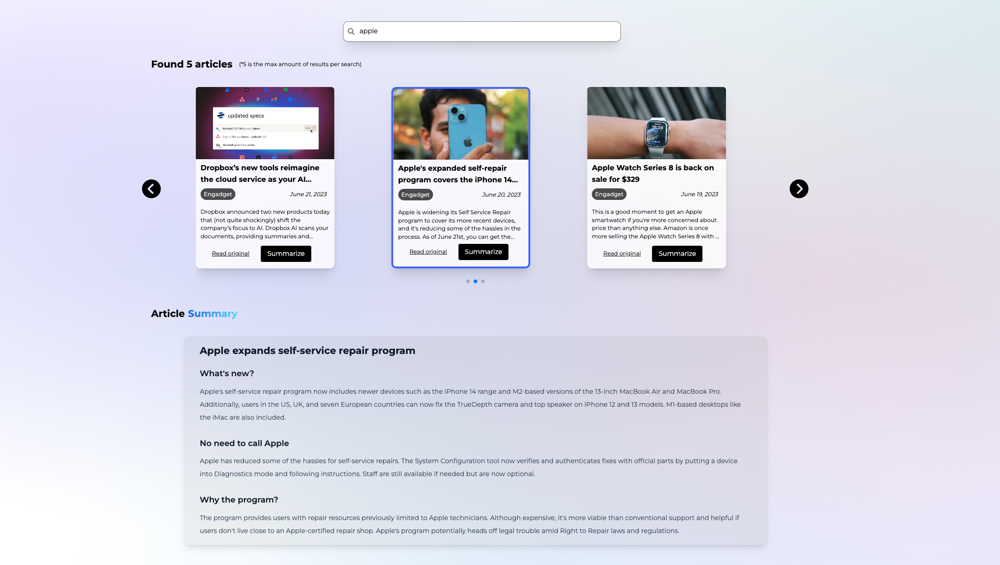

# GPT-NEWS

[Website (Vercel)](https://gpt-news-kxse.vercel.app) 

GPT-News is a tech news blog that leverages the power of ChatGPT to provide summaries of the latest tech articles from the best sources in the industry. The project automatically generates new summaries of main tech articles every day, allowing users to stay updated with the most important information in the tech field. It also offers a search feature that enables users to find tech news on specific topics and dynamically generates summaries for the searched articles, providing efficient news consumption.

In addition to daily news updates and search functionality, GPT-News includes a TL;DR (Too Long; Didn't Read) feature. This feature presents bullet-point summaries of the most important and interesting news of the day, allowing users to quickly grasp the key points without going through lengthy articles. The project is designed to be responsive and supports both web and mobile devices, ensuring a seamless user experience across different platforms.

  
  

## Project Structure and technologies

The project utilizes Next.js for its server-side rendering capabilities. It consists of various components, API routes, and database integration. The core functionality revolves around fetching information from tech sources and generating summaries using ChatGPT. The project utilizes Next.js SSR, allowing for rendering React components on the server, resulting in fast initial page loads and improved SEO performance. 

Additionally, the project features API routes that trigger automatic news generation by the GPT model on a daily basis. It incorporates the NewsAPI.org service for searching news on specific topics and utilizes the JSDOM library for efficient data scraping. OpenAI API is leveraged for summary generation, enabling concise and digestible information for dynamically searched articles.

### Tech:

- **Next.js**: Next.js is used as the foundation for the project, providing server-side rendering (SSR) capabilities and enabling efficient client-side rendering for improved performance.

- **Prisma ORM and MySQL**: Prisma ORM is employed for interacting with the database, and MySQL is chosen as the database system for storing article summaries and daily news updates.

- **TypeScript** and **React**: TypeScript is used for strong typing and enhanced productivity, while React provides a powerful framework for building user interfaces in a modular and reusable manner.

- **Tailwind CSS**: Tailwind CSS is utilized for styling the project, providing a utility-first CSS framework that enables rapid development and customization.

- **API Routes**: The project includes API routes that handle specific functionalities, such as triggering automatic news generation by the GPT model every day.

- **NewsAPI.org**: The NewsAPI.org service is utilized for searching and retrieving tech news from various sources

- **JSDOM**: The JSDOM library is employed for data scraping, enabling the extraction of article content from HTML and DOM structures.

- **OpenAI API**: The OpenAI API is utilized for generating article summaries using the ChatGPT model, providing concise summaries of the tech news articles.
